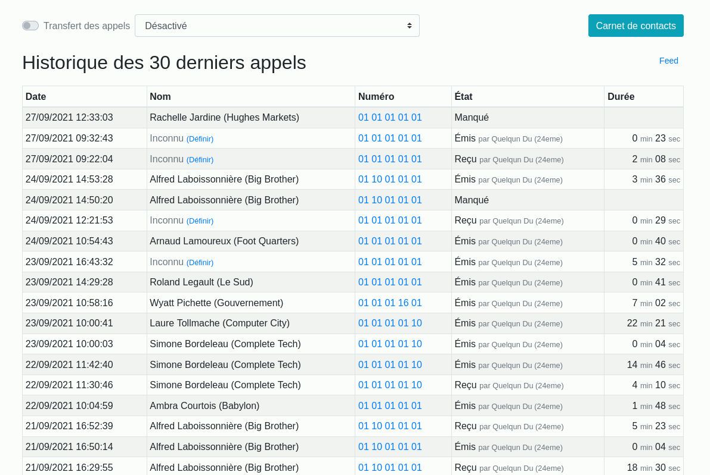

# Historique téléphonique OVH

Interface web qui permet gérer les appels d'une ligne voip chez ovh :

- Consulter l'historique des 30 derniers appels
- Changer le transfert d'appel
- Consulter l'annuaire téléphonique d'ovh



## Installation

Dependances :

```bash
sudo aptitude install php php-json php-curl
```

Create config file :
 
```bash
cp app/config.{example,}.php
```

Configure it with your ovh api keys : https://docs.ovh.com/gb/en/customer/first-steps-with-ovh-api/
 
Run public/index.php to test it :

```bash
php -S localhost:8000 -t public
```
